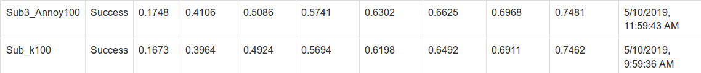
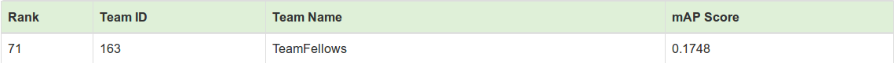

# [AI City Challenge 2019](https://www.aicitychallenge.org/2019-challenge-tracks/)

**Team Members** :  Avinash Kappa, Nitin Kumar, Pramod Geddam and Shubham

---

## Problem Statement

**Challenge Track 2 :  City-Scale Multi-Camera Vehicle Re-Identification**

Perform vehicle re-identification based on vehicle crops from multiple cameras placed at multiple intersections. This helps traffic engineers understand journey times along entire corridors.

---

## Dataset

Dataset : [Link](http://www.aicitychallenge.org/track2-download/)

The dataset contains 56,277 images, where 36,935 of them come from 333 object identities form the training set and 18,290 from the other 333 identities in the test set. An additional 1,052 images are used as queries. On average, each vehicle has 84.50 image signatures from 4.55 camera views.

Content in the directory:

1. "image_query/".  This dir contains 1052 images as queries. 
2. "image_test/".   This dir contains 18290 images for testing. 
3. "image_train/". This dir contains 36935 images for training. 
4. "name_query.txt". It lists all query file names.
5. "name_test.txt". It lists all test file names.
6. "name_train.txt". It lists all train file names.
7. "test_track.txt" & "test_track_id.txt". They record all testing tracks. Each track contrains multiple images of the same vehicle captured by one camera.
8. "train_track.txt" & "train_track_id.txt". They record all training tracks. Each track contrains multiple images of the same vehicle captured by one camera.
9. "train_label.xml". It lists the labels of vehicle ID and camera ID for training.
10. "train_label.csv". It lists the labels of vehicle ID in CSV format for training. 
11. "tool/visualize.py" & "tool/dist_example/". It is a Python tool for visualizing the results of vehicle re-identificaition, with an example of input data provided. 
12. "DataLicenseAgreement_AICityChallenge.pdf". The license agreement for the usage of this dataset.

---

## Evaluation Task

Find the image(s) in the test set that are from the same identity as the objects in each query image particulary, a list of the top 100 matches from the test set for each query image.

---

## Approach

We decided to solve this challenge using two approaches detailed below.

1) **Image Classifiers**

We are given 36935 training images where each image corresponding to one of the 333 classes. We will train a image classifier with ResNet50 as architecture using different pretrained models using fast.ai. Now we have two ways of training image classifier.

- **ImageNet pretrained model** : This is straight forward approach of using ResNet50 model trained on ImageNet dataset is used as pretrained model for image classifier. This classifier will classify training images into 333 classes.(*Easy, no?*)
    
- **Stanford Cars pretrained model** : Here we will train a seperate ResNet50 model on [stanford cars dataset](https://ai.stanford.edu/~jkrause/cars/car_dataset.html) which contains 16185 car images to be classified into 196 classes of cars. We will use the pretrained model trained on stanford cars dataset instead of ImageNet as done above to classify the training images from Nvidia AI City Challenge into 333 classes.
  
 
After we train classifier we use the penultimate layer (Linear layer of size 512) to extract features of size 512 for each test and query image. As evaluation task demands us to find top 100 test images matching to each query image in ascending order of distance, we will find the distances using three methods:

- **KNeighbours** :  We use the [KNeighbours](https://scikit-learn.org/stable/modules/generated/sklearn.neighbors.NearestNeighbors.html) from sklearn library to fit all 512 features of 18290 test image for different values of k and use [kneighbours](https://scikit-learn.org/stable/modules/generated/sklearn.neighbors.NearestNeighbors.html#sklearn.neighbors.NearestNeighbors.kneighbors) function on each query image to obtain 100 neighbours (as we need top 100 test image).

-  **Annoy** : We use [Annoy](https://pypi.org/project/annoy/) library to find 100 nearest neighbours for each query image.

- **Euclidean Distance** :  This is the simplest approach to obtain the distance for each query image. We find the distance for each query image with all test image using `numpy.linalg.norm` to get top 100 test images in ascending order of distances.

2) **Siamese Networks**

We will use siamese network with triplet loss as baseline. 

---

## Experiments

As stanford cars dataset contains cars, we decide to use the model trained pretrained using stanford cars dataset as our model for experiment.

### KNeighbours

We experiment with different values of k for fitting 18290 test features each of size 512.

- k = 333

- k = 100

- k = 10

We observe that k=333, k=100 and k=10 yield same results.

### Annoy

We experiment with different values of k for fitting 18290 test features each of size 512.

- k = 300

- k = 100

- k = 10

We observe that k=300 and k=100 yield same results and k=10 gives bad results than both.

### Eucledian

This gives same result as k=333.

### Submission

We submit two results i.e. k=333 from KNeighbours and k=300 from Annoy were submitted. This is the result we obtain using the [evaluation server](https://eval.aicitychallenge.org) of Nvidia Challenge.

---

## Results

We **rank 71 among 84 teams** that participated in the Nvidia AI City challenge for track-2.

---

## Improvements and Next Steps

Rank 71, Good?

4 days from training to first submission on last day of challenge, well we tried and learned a lot!

Next Steps,

Classifier models give good embeddings, clustering and getting top 100 test images gave okayish results.

Siamese Network will yield impressive results as they are specifically designed to handle comparison of input images. Experiment with different loss functions like ArcFace, ArcMargin Loss, etc. Also, different batch sampling like Batch Hard (BH), Batch Sample (BS), Batch Weight(BW) and Batch All(BA).

--- 

## Reference Papers

1. [CityFlow: A City-Scale Benchmark for Multi-Target Multi-Camera Vehicle Tracking and Re-Identification](https://arxiv.org/pdf/1903.09254)

2. 

---

## Credits

Dataset for AI City Challenge : Nvidia

Dataset for Stanford Cars : Stanford

Fastai Library

---

**Note** : For pretrained model and training on stanford cars dataset, refer `Stanford_Cars_fastai.ipynb` notebook in same directory.

---

